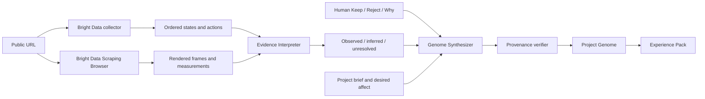

# EXPERIENCE//COMPILER


**Observe the experience. Supply the judgment. Compile what mattered.**

[Live product](https://experience-genome.vercel.app) · [Live compiler](https://experience-genome.vercel.app/#capture-lab) · [Drift Lab](https://experience-genome.vercel.app/lab/drift) · [Source](https://github.com/KabeerY/experience-genome)

Experience Compiler visits a public interactive website, records an ordered browser journey, asks a human what mattered, and compiles the combination into reusable design rules for coding agents—without cloning the reference.

```text
real experience → rendered evidence → bounded inference → human judgment
                → Project Genome → provenance verification → agent context
```

## The product

A judge can paste any public URL and use the real workflow:

1. A Bright Data collector records ordered state/action/state evidence.
2. Bright Data Scraping Browser captures real rendered frames and browser measurements at bounded scroll positions.
3. A Fireworks multimodal Evidence Interpreter separates observation, inference, and unresolved unknowns.
4. The human marks the proposed principle **Keep** or **Leave behind** and can explain why.
5. A Fireworks Genome Synthesizer proposes inherited, mutated, rejected, and invented project rules.
6. A deterministic verifier rejects invalid provenance or crossed judgment lanes.
7. The browser downloads an Experience Pack containing evidence, rules, unknowns, anti-copy constraints, screenshots, and adapters for Codex, Claude, Gemini, Cursor, and Copilot.

No login or prepared per-site response is required. A workshop session persists locally in IndexedDB so a browser refresh does not destroy captured evidence or human judgment.

## Why this is different

A screenshot captures appearance. A DOM scrape captures symbols and structure. Neither establishes the ordered experience around them: what appeared after a scroll, what remained fixed, or what a particular human loved.

Experience Compiler keeps three truths distinct:

| Truth | Question | Source |
| --- | --- | --- |
| Descriptive | What was visible and what changed? | rendered frames, measurements, ordered states |
| Interpretive | What principle might explain the experience? | calibrated model inference |
| Normative | Did it matter to this person? | explicit Keep/Reject decision and note |

That is why evidence basis and human judgment are separate fields. Something can be directly observed and still be disliked; something can be inferred and preferred.

## Bright Data is the perception layer

Bright Data is used twice in every complete live run:

- A custom Scraper Studio collector returns a bounded structured journey.
- Scraping Browser renders the supplied page, settles at five distributed scroll positions, captures JPEG evidence, and measures visible headings, fixed/sticky layers, active animations, and transformed elements.

If the rendered layer is unavailable, the interface says so and the model receives measurements only. It never labels a measurement-only run as visual input. If collection fails, no stored response is silently substituted.

The separate [Drift Lab](https://experience-genome.vercel.app/lab/drift) is a controlled fixture for the repeatable break → same-collector heal → recover proof. It is deliberately separate from arbitrary live web capture.

Historical Bright Data artifacts, including failed attempts and the controlled recovery ledger, remain in [`evidence/brightdata`](evidence/brightdata).

## Bounded agent architecture

This is not an agent swarm. Two model roles sit inside a compiler pipeline:

```text
Bright Data Journey Scout
          ↓
Evidence Interpreter (Fireworks / Kimi K2.6)
          ↓
Human taste gate
          ↓
Genome Synthesizer (Fireworks / Kimi K2.6)
          ↓
Deterministic provenance verifier
          ↓
Portable Experience Pack
```

The model boundary is OpenAI-compatible and provider-neutral. Fireworks is the validated deployment provider; interpreter and synthesizer model IDs can be changed independently.

Structured generation uses:

- JSON Schema-constrained output;
- the same schema embedded in the prompt;
- one bounded repair attempt;
- Zod parsing;
- semantic checks for evidence citations, source keys, judgment lanes, invention, and unresolved claims.

## Architecture



Core stack:

- Next.js 16, React 19, TypeScript
- React Three Fiber, Three.js, and CSS scroll choreography
- Bright Data Scraper Studio and Scraping Browser
- Fireworks OpenAI-compatible inference with Kimi K2.6
- Zod for contracts and provenance verification
- Sharp for ordered multimodal contact sheets
- JSZip for client-side portable artifacts
- IndexedDB for local session persistence
- Vercel for deployment; no database and no authentication are required

## Experience Pack

```text
experience-pack/
├── README.md
├── manifest.json
├── genome/
│   ├── PROJECT_GENOME.json
│   └── EVIDENCE.json
├── evidence/
│   └── 01-reference-moment-1.jpg
├── design/
│   ├── PRINCIPLES.md
│   └── UNRESOLVED.md
├── intent/
│   ├── PROJECT_BRIEF.md
│   └── ANTI_COPY.md
└── agents/
    ├── AGENTS.md
    ├── CLAUDE.md
    ├── GEMINI.md
    ├── cursor.mdc
    └── copilot-instructions.md
```

## Run locally

```bash
corepack enable
pnpm install
cp .env.example .env.local
pnpm dev
```

Open `http://localhost:3000`.

Required server-side variables:

```bash
BRIGHT_DATA_API_TOKEN=
BRIGHT_DATA_COLLECTOR_ID=
BRIGHT_DATA_BROWSER_ZONE=cli_browser

MODEL_PROVIDER=fireworks
MODEL_BASE_URL=https://api.fireworks.ai/inference/v1
FIREWORKS_API_KEY=
MODEL_ID=accounts/fireworks/models/kimi-k2p6
VISION_MODEL_ID=accounts/fireworks/models/kimi-k2p6
SYNTHESIS_MODEL_ID=accounts/fireworks/models/kimi-k2p6
INTERPRETER_ENABLE_VISION=true
```

Secrets remain server-side. Only public, non-login URLs are accepted, private-network destinations are rejected, same-origin API requests are enforced, and capture requests are rate bounded.

Quality gates:

```bash
pnpm test
pnpm lint
pnpm build
```

Submission helpers: [`docs/DEMO_SCRIPT.md`](docs/DEMO_SCRIPT.md) · [`docs/SUBMISSION_COPY.md`](docs/SUBMISSION_COPY.md)

## AI use disclosure

- OpenAI Codex assisted implementation, research, testing, visual QA, deployment, and repository maintenance.
- ChatGPT was used as a product-thinking collaborator during the architecture and narrative critique.
- OpenAI image generation produced an original light monsoon-landscape plate used behind the code-native parallax story.
- Fireworks-hosted Kimi K2.6 performs live evidence interpretation and Project Genome synthesis.

## Truth and anti-copy contract

- Observations, inferences, human statements, and unresolved dimensions remain visibly distinct.
- Three sampled frames do not establish frame-perfect timing, easing, hover physics, audio, or universal causation.
- Every non-invented project rule must retain a judged source reference.
- Invented rules cite no source evidence.
- Outputs prohibit reusing source assets, copy, layout, geometry, exact timing, camera paths, or brand language.

---

> **The machine records what happened. The human decides what mattered.**
