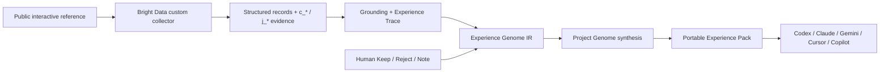

# EXPERIENCE//COMPILER


**Observe the experience. Supply the judgment. Compile what mattered.**

[Live product](https://experience-genome.vercel.app) · [Genome Lens](https://experience-genome.vercel.app/studio) · [Drift Lab](https://experience-genome.vercel.app/lab/drift) · [Controlled fixture](https://experience-genome.vercel.app/fixture?representation=baseline)

Experience Compiler turns interactive web evidence plus human taste into portable design rules for any coding AI—without cloning the references.

```text
real experience → evidence → inference → human judgment
                → reusable rule → multi-reference synthesis → agent context
```

## The problem

A screenshot captures appearance. A DOM scrape captures symbols and structure. Neither reliably captures the ordered experience around them: what changed after a scroll, what waited before appearing, or which part a particular human actually loved.

Experience Compiler preserves three different kinds of truth:

| Truth | Question | Source |
| --- | --- | --- |
| Descriptive | What happened? | state/action/state evidence |
| Causal | What changed after an action? | observed deltas, with stronger claims only when grounded |
| Normative | Did this matter? Was it liked? | explicit human judgment |

That is why `epistemicBasis` and `humanJudgment` are separate fields. A rule can be both `observed` **and** `preferred`.

## What a judge can do

1. Experience the four-act WebGL story: False Reading → Perception → Memory → Compilation.
2. Open **Genome Lens** and click a Genome Rule.
3. Inspect its complete path: state/action/state → delta → inference → human judgment.
4. Change Keep/Reject judgment without rewriting the evidence.
5. Enter **Dream Foundry** to inspect inherited, mutated, rejected and invented Project Rules.
6. Compile a real `experience-pack.zip` containing canonical JSON, evidence, anti-copy constraints and adapters for Codex, Claude, Gemini, Cursor and Copilot.
7. Open **Drift Lab** to distinguish the real-web product proof from a deterministic same-Collector-ID healing experiment.


## Why Bright Data is central

Bright Data is the perception layer—not a decorative API call.

- A **custom Scraper Studio collector** produces structured records from public web pages.
- Every run keeps its `c_*` collector identity and `j_*` job identity.
- Collected records are normalized into an **Experience Trace**: ordered states, triggering actions and observed deltas.
- Verified captures are persisted as replay artifacts so every public demo view does not consume another credit.
- A separate public fixture changes its representation while retaining the same visible meaning and output contract. That creates a controlled break → heal → recover experiment.

### Credit discipline

The public deployment never exposes an unrestricted collection endpoint. It runs in **Verified Replay** mode. Live collection is an operator-only submission/video step. This prevents abuse and preserves the 5,000-credit grant for judging.

Current bounded plan: one three-record baseline, one expected broken run, one same-ID heal, one three-record recovery, and a very small real-web capture. No broad crawling.

### Bright Data evidence ledger

| Artifact | Status | Evidence |
| --- | --- | --- |
| Initial observer attempt | Failed before template generation; no records | [`evidence/brightdata/observer-create.json`](evidence/brightdata/observer-create.json) |
| Drift collector | Building | `c_*` will be written here after creation |
| Baseline job | Not run | exactly 3 expected records |
| Broken job | Not run | expected contract failure on shifted representation |
| Same-ID heal | Not run | must retain the same `c_*` |
| Recovery job | Not run | exactly 3 expected records |

The UI and this table remain explicit about unknown or pending evidence. A failed attempt is kept in history rather than erased.


## Architecture



The build is deliberately a compiler pipeline, not an agent swarm:

```text
Ground → Abstract → Judge → Synthesize → Verify → Compile
```

- **Next.js 16 / React 19** on Vercel
- **React Three Fiber / Three.js** for the scroll-linked archive world and Akshar/Gati familiars
- **Zod** for the canonical intermediate representation and provenance constraints
- **JSZip** for client-side portable pack compilation
- **Bright Data Scraper Studio** for public-web grounding and self-healing proof
- **OpenAI-compatible model provider boundary** for OX Alpha today and Fireworks/other providers later
- No authentication and no database in the hackathon path; replay JSON is versioned, judgments stay local, and the artifact downloads as a ZIP

## Intermediate representation

The central object is not a prompt. It is a verifiable Experience Genome.

```ts
type GenomeClaim = {
  epistemicBasis: "observed" | "inferred" | "user-specified" | "unresolved";
  humanJudgment: "preferred" | "rejected" | "neutral" | "unreviewed";
  evidenceRefs: string[];
  statement: string;
  interpretation?: string;
  humanNote?: string;
};
```

The verifier rejects an `observed` claim without evidence, unknown evidence references, or a non-invented Project Rule without a source claim.

## Experience Pack

```text
experience-pack/
├── manifest.json
├── genome/
│   ├── EXPERIENCE_GENOME.json
│   ├── PROJECT_GENOME.json
│   ├── EVIDENCE.json
│   └── TRACES.json
├── design/
│   ├── FORM.md
│   ├── MOTION.md
│   ├── SCENE.md
│   ├── AFFECT.md
│   └── TOKENS.json
├── intent/
│   ├── PROJECT_BRIEF.md
│   └── ANTI_COPY.md
└── agents/
    ├── AGENTS.md
    ├── CLAUDE.md
    ├── GEMINI.md
    ├── cursor.mdc
    └── copilot-instructions.md
```

## Run locally

```bash
corepack enable
pnpm install
pnpm dev
```

Then open `http://localhost:3000`.

Quality gates:

```bash
pnpm lint
pnpm build
```

## Environment contract

The checked-in public demo does not require secrets. Operator-only live modes use server-side variables:

```bash
BRIGHT_DATA_API_TOKEN=
MODEL_PROVIDER=openrouter
MODEL_BASE_URL=https://openrouter.ai/api/v1
MODEL_API_KEY=
MODEL_ID=stealth/ox-alpha
```

Secrets never enter client bundles. A provider capability check is required before switching models; OpenAI-compatible transport does not guarantee equivalent structured-output behavior.

## AI use disclosure

- OpenAI Codex was used for implementation, visual QA, testing and repository maintenance.
- OpenAI image generation produced the original ancient-future archive concept used as a landing-page memory plate; it does not copy a supplied site or copyrighted character.
- ChatGPT was used as a product-thinking collaborator during scope correction and narrative development.
- The committed synthesis artifact is a deterministic verified replay. Live model generation is kept behind the provider boundary so the public demo remains stable and does not expose keys.

## Truth and anti-copy contract

- Observations, inferences, user statements and unresolved dimensions are visibly labeled.
- Action-conditioned change is not automatically promoted to universal causation.
- Project synthesis stores **inherited / mutated / rejected / invented** provenance.
- Outputs explicitly prohibit copying source geometry, timing values, copy, camera paths, layout chrome or brand language.
- Only public, non-login, non-personal data is in scope.

---

> **The machine records what happened. The human tells it what mattered.**
